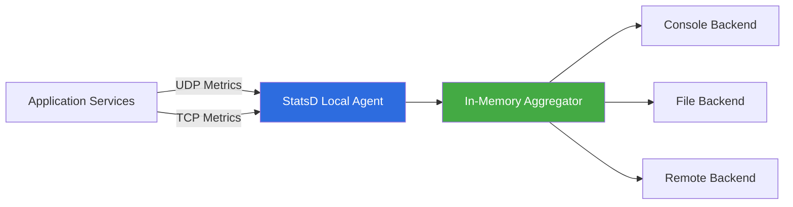

# 🚀 StatsD Local Agent

<p align="center">


</p>

A lightweight, high-performance **StatsD-compatible telemetry aggregation agent** built for **local-first** and **resource-constrained environments**.

Unlike traditional telemetry daemons such as **StatsD** or **Telegraf**, which provide extensive features at the cost of higher CPU and memory usage, this project focuses on a minimal architecture capable of ingesting millions of telemetry events while maintaining a very small runtime footprint.

The agent accepts telemetry over **UDP** and **TCP**, performs **in-memory aggregation**, and periodically flushes aggregated metrics to configurable local or remote backends.

---

# Why?

Modern observability stacks are incredibly powerful, but they're often unnecessarily heavy for:

- Edge devices
- Raspberry Pi deployments
- Developer workstations
- Local Kubernetes clusters
- Resource-constrained virtual machines
- Embedded monitoring environments

Most applications don't require a complete telemetry pipeline.

They simply need a lightweight process that can efficiently collect metrics without becoming another resource bottleneck.

This project was built to solve exactly that problem.

---

# Features

- ⚡ High-throughput UDP metric ingestion
- 🔒 Reliable TCP metric ingestion
- 🧠 Protocol-independent aggregation engine
- 🚀 Zero external dependencies during runtime
- 💾 In-memory aggregation
- 📉 Reduced backend write amplification
- 🔄 Atomic object swapping during flush
- 🔌 Plug-and-play backend architecture
- 🪶 Extremely lightweight Node.js event-driven implementation

---

# Architecture



---

# Telemetry Pipeline

The agent follows a simple but efficient processing pipeline:

1. Receive metrics over UDP or TCP.
2. Parse incoming telemetry packets.
3. Aggregate metrics entirely in memory.
4. Periodically flush aggregated metrics.
5. Dispatch them to one or more configured backends.

Since aggregation happens before persistence, repeated updates to the same metric are condensed into a single write operation, dramatically reducing backend I/O.

---

# Supported Telemetry

The agent currently supports the standard **StatsD metric types**.

| Metric | Description |
|----------|------------|
| Counter | Counts events (requests, errors, retries) |
| Gauge | Represents current values such as memory or CPU usage |
| Timer | Stores latency measurements for percentile calculations |
| Sets | Tracks unique values |
| Custom Metrics | Easily extensible through the parser pipeline |

Typical telemetry collected includes:

```
api.requests:1|c
api.errors:1|c
http.latency:24|ms
cpu.usage:41|g
memory.used:312|g
active.users:153|g
cache.hit:1|c
cache.miss:1|c
worker.jobs:18|g
```

Applications can continuously stream telemetry without needing to know where or how the metrics are eventually stored.

---

# Multi-Protocol Ingestion

To balance throughput and reliability, the agent exposes two independent listeners.

## UDP

Designed for:

- High-frequency metrics
- Fire-and-forget telemetry
- Low-overhead communication

Ideal for:

- Counters
- Gauges
- Request rates

---

## TCP

Designed for:

- Reliable delivery
- Long-lived streams
- Larger payloads

A simple line-buffering implementation ensures partial packets are reconstructed before parsing.

```javascript
const net = require('net');

exports.start = function(server_config, handlePacket) {
    net.createServer((socket) => {

        let buffer = '';

        socket.on('data', (data) => {

            buffer += data.toString();

            let lines = buffer.split('\n');

            buffer = lines.pop();

            for (const line of lines) {

                if (line.trim().length > 0) {
                    handlePacket(line, socket.remoteAddress);
                }

            }

        });

    }).listen(server_config.port || 8125);
};
```

---

# High Performance Aggregation

Incoming telemetry is never written directly to disk.

Instead, metrics are aggregated inside memory structures.

During every flush interval, active objects are swapped atomically.

This completely avoids expensive key-by-key deletion and minimizes pauses during burst traffic.

```javascript
let counters = {};
let timers = {};

function flushMetrics() {

    const activeCounters = counters;
    const activeTimers = timers;

    counters = {};
    timers = {};

    const timestamp =
        Math.round(new Date().getTime() / 1000);

    backendEvents.emit("flush", timestamp, {

        counters: activeCounters,
        timers: activeTimers

    });

}
```

Advantages:

- O(1) reset operation
- Reduced garbage collection pressure
- Continuous packet ingestion during flushing
- Lower memory fragmentation

---

# Backend Architecture

The aggregation layer is completely independent from storage.

Current backends include

- Console
- Local file
- Remote transport

Additional exporters can be added without modifying the aggregation pipeline.

---

# Performance Evaluation

The project was evaluated using a synthetic workload consisting of **10 million telemetry events**.

### Environment

| Component | Value |
|------------|-------|
| OS | Ubuntu 22.04 LTS |
| Runtime | Docker |
| Language | Node.js |
| Monitoring | iotop |
| Disk Analysis | iostat -dx 1 |

---

## Dataset

- 10,000,000 telemetry packets
- Approximately 100 MB payload
- Mixed counters and timers
- Variable cardinality

---

# Write Amplification Reduction

The effectiveness of aggregation was measured using the standard Write Amplification Factor.

\[
WAF = \frac{\text{Disk Bytes Written}}
{\text{Raw Telemetry Bytes}}
\]

Results

| Workload | Improvement |
|------------|-------------|
| Low Cardinality | ~60% reduction |
| High Cardinality | ~40% reduction |

Instead of writing millions of updates, repeated metric values are merged into a single aggregated write.

---

# Why Atomic Swapping?

Traditional implementations often iterate through every metric and delete them individually after flushing.

For millions of metrics this introduces:

- unnecessary CPU overhead
- garbage collection pressure
- ingestion stalls

This implementation simply swaps object references.

```
Current Objects
        │
        ▼
+----------------+
| counters       |
| timers         |
+----------------+

        │

Swap References

        ▼

Old Objects  ---> Backend Flush

New Empty Objects ---> Continue Ingestion
```

This keeps ingestion almost uninterrupted even during flush operations.

---

# Future Roadmap

The current implementation follows a push-based architecture.

```
Applications
      │
UDP / TCP
      │
      ▼
StatsD Local Agent
      │
      ▼
In-Memory Aggregation
      │
      ▼
Backends
```

The next stage introduces a lightweight **Go exporter** capable of exposing a Prometheus-compatible `/metrics` endpoint while preserving the existing low-overhead design.

Future architecture:


The exporter will also integrate intelligent query optimization techniques explored in:

**PromQL Cost Analyzer & ML**

https://github.com/avy252004/PromQL_cost_analyzer_ML

---

# Future Enhancements

- Prometheus exporter
- Shared-memory backend
- UNIX domain socket transport
- Histogram support
- OpenTelemetry compatibility
- eBPF-based collectors
- Dynamic backend plugins
- Distributed aggregation

---

# Design Goals

- Minimal resource consumption
- Low latency
- High throughput
- Local-first deployment
- Easy extensibility
- Protocol independence

---

# License

MIT License
