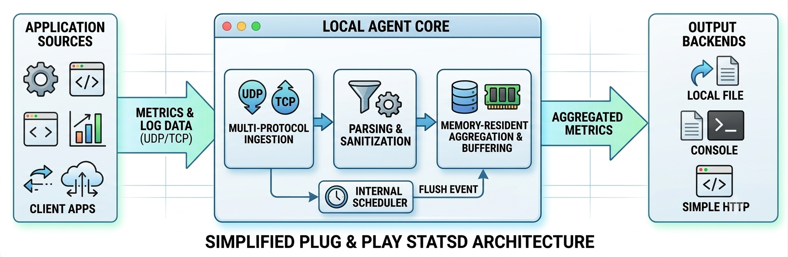

# StatsD-Local-Agent

A lightweight, high-performance, plug-and-play StatsD agent designed for local-first telemetry. Perfect for developers who want to monitor their applications locally without cloud dependency, external subscriptions, or heavy infrastructure.

## Overview
This agent acts as a local metrics aggregator. It listens for incoming metrics and logs, aggregates them in memory, and flushes them to local destinations (Console, File, or local HTTP endpoints).

## Key Features
*   **Multi-Protocol Ingestion:** Supports both UDP (fast, fire-and-forget) and TCP (reliable streaming) inputs.
*   **Local-First:** No cloud dependencies—designed to run entirely on `localhost` or within your internal infrastructure.
*   **Zero-Cost:** Eliminates external monitoring service fees.
*   **Pluggable Backends:** Easily extend to output data to whatever local system you use.
*   **Efficient Aggregation:** Minimizes system overhead by buffering and flushing metrics on a set interval.

## Getting Started
1.  **Clone the repo:** `git clone <your-repo-url>`
2.  **Configure:** Edit `settings.conf` to define your input ports and flush intervals.
3.  **Run:** `node agent.js`

## How it Works
1.  **Ingestion:** Apps send metrics/logs via UDP or TCP.
2.  **Parsing:** The agent sanitizes and parses incoming packets.
3.  **Aggregation:** Data is stored in memory as counters, timers, and gauges.
4.  **Flush:** The internal scheduler triggers a periodic flush to your chosen backend (Console, File, or API).

---
*Built for developers who value simplicity, performance, and local control.*
